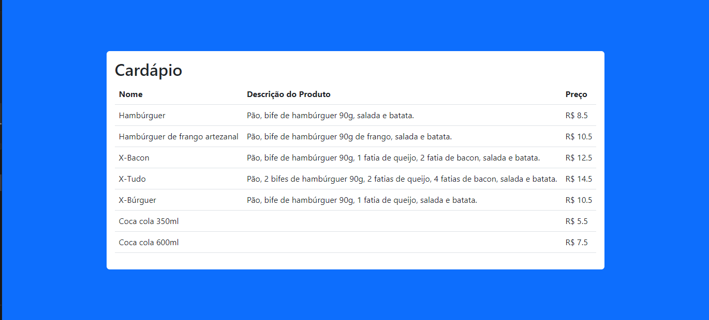

# Projeto desenvolvido com

Este Projeto é um visualização de um cardápio para aplicar a api fake json-server .

 

  

## Site do Projeto

## Repositorio do Projeto

https://github.com/JacquelineCasali/cardapio-react-json

## Instalação

## FRONTEND

1. `$ cd frontEnd`
2. `$ npm install`
3. `$ npm start`

## BackEnd

1. `$ cd server`
2. `$ npm run start`

## Descrição

--API fake - utilizando o json-server

## Bibliotecas Usadas

## FRONTEND

-- `Axios`
-- `React.js`
-- `Bootstrap`

 ## Back-end
-- `json-server`

